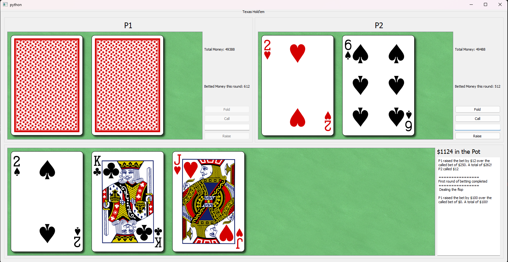
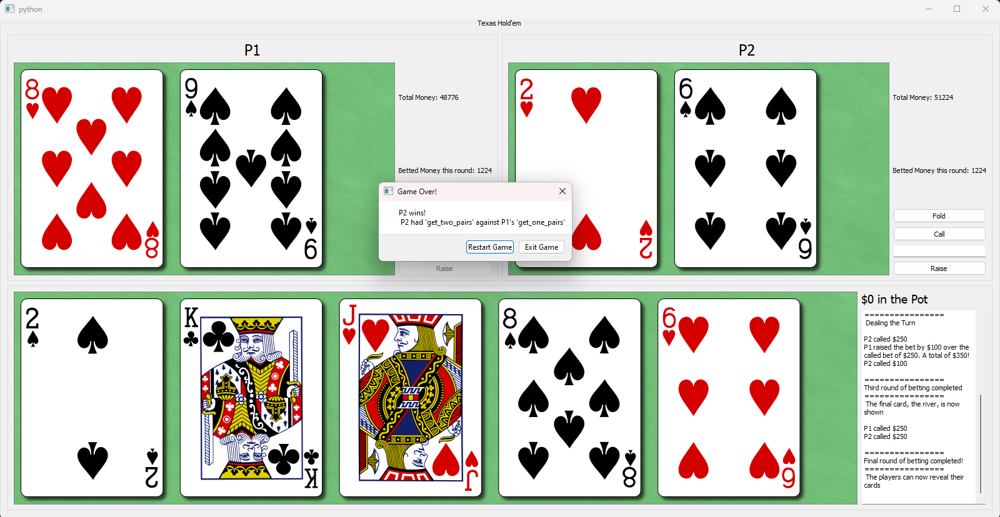

## About this repository
##### UPDATE!
Now, the repository includes a file written in RobotFramework which uses Sikuli to automate testing the GUI. Look below to find out how to run.

 
This repository contains a mini-project submitted as a part of a university course in Python 'Object-oriented programming in Python'. This contains a small GUI made through PyQt5 which simulates a game of Texas hold'em poker between two players. Cards are dealt on the table below the players cards in succession as first two cards, then the flop, the turn and finally the river. Both players start with $250 as the starting bet.

players can either fold their cards and accept defeat. Or they can call on ongoing bet to stay in the game. if they are feeling lucky however, they can raise the bet by any amount of money through the input box provided to them. 

The player with the greater hand wins and gets the pot money. On restarting, the winning player start with greater money.

## How to run
After cloning it to a local directory, the desktop app can be launched using:
<code>py -3 pokergame.py</code> (for windows)
<code>python3 pokergame.py</code> (for mac/linux)

##### UPDATE!
If you want to let the robot framework test for you, the script main.robot would run a simple test where every player would call the bet and let the table decide the outcome. To run this script, make sure to open two terminals and run
<code>robot -d reports main.robot</code>
first, and then in the other terminal, run
<code>py -3 pokergame.py</code> (for windows)
<code>python3 pokergame.py</code> (for mac/linux)

## How to test card library
The card library contains the functions that are used to simulate the poker logic in the gui. A file `test_cardlib.py` is included which include test cases to test the card library. These tests can be run using:
<code>py -3 -m pytest -vs</code>
The `-vs` tag enables viewing the test output in the terminal.

## Dependencies
The code is tested in python 3.9 with the following packages:
<pre>
colorama                     0.4.6
iniconfig                    2.0.0
packaging                    24.0
pip                          24.0
pluggy                       1.4.0
PyQt5                        5.15.10
PyQt5-Qt5                    5.15.2
PyQt5-sip                    12.13.0
pytest                       8.0.2
robotframework               7.0
robotframework-SikuliLibrary 2.0.3
setuptools                   65.5.0
</pre>
the `requirements.txt` file is also included.

